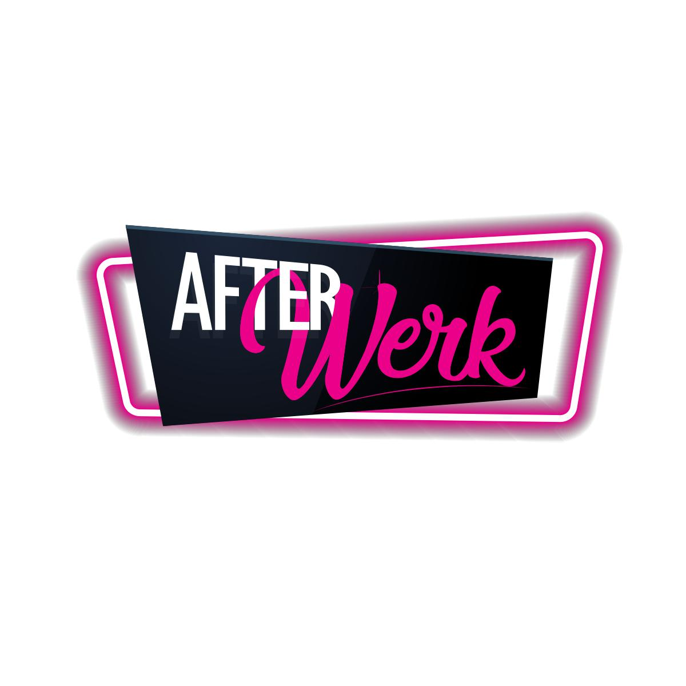

# AfterWerk
After Werk is a lifestyle brand dedicated to being your best outside work. We enable connecting with others through fun events, practissing self-care with help from products in our online store

**Website:** https://afterwerk.netlify.app/

<a target="_blank" href="https://afterwerk.netlify.app/">
    

    
    

</a>

## How It's Made:

**Tech used:** HTML, CSS, SASS, Javascript, NPM, Node.js, Git, Github, Netlify
 
## Optimizations

Lighhouse scan items pending
Webpack to offer more perfomant builds
Moving images to https://cloudinary.com/ toimprove performance

## Lessons Learned:

Using an exisiting design wether as figma file or existing website as inspiration results in better looking website.
More research on optiomal builds and image management would have result in better performance. 

